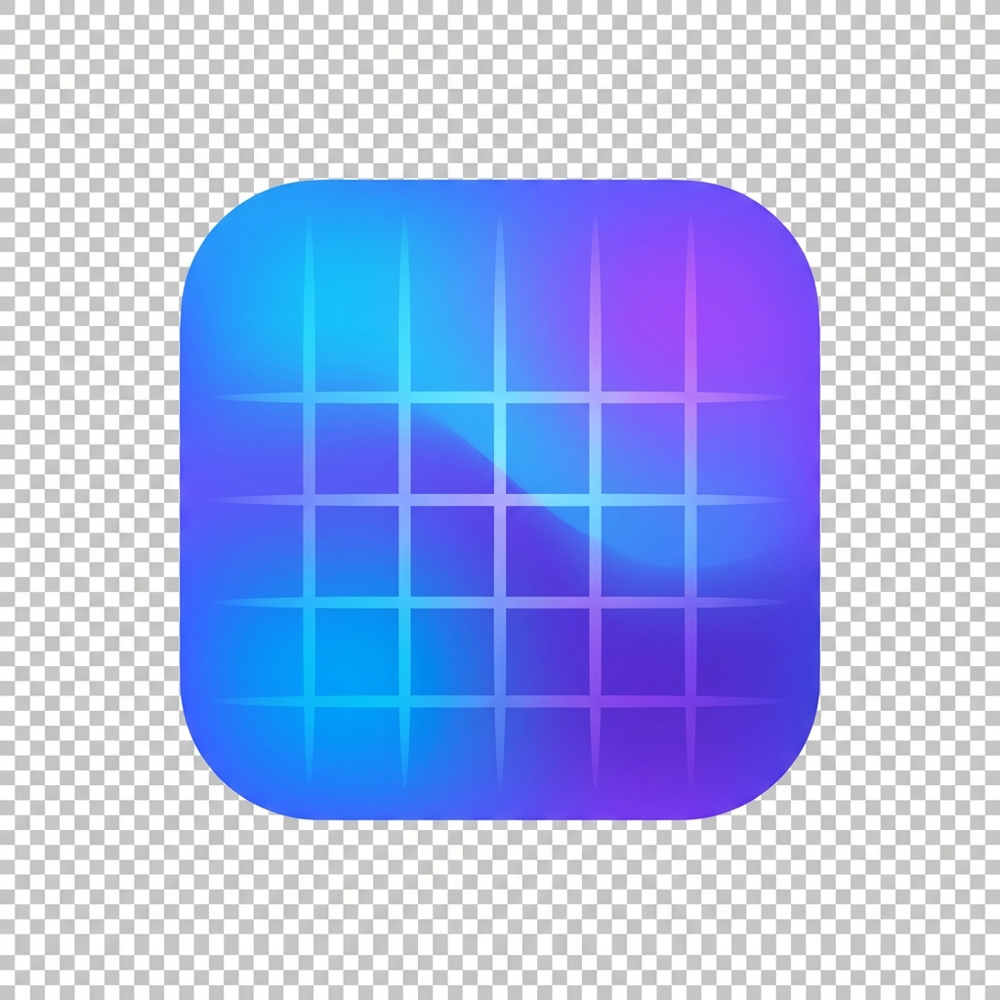

  

<h1 align="center">UniSchedule</h1>

  <strong>Effortless Timetable Generation for Modern Education</strong>

  
  
  

---

## 🌟 Overview

**UniSchedule** is a high-performance, aesthetically pleasing timetable generator designed for schools, colleges, and universities. It streamlines the complex task of managing courses, instructors, and constraints, producing conflict-free schedules in seconds.

### ✨ Key Features

- 📅 **Smart Auto-Scheduler**: Advanced logic to prevent class overlaps and instructor conflicts.
- 🎓 **Course Management**: Effortlessly organize your curriculum with search and smart sorting.
- 👨‍🏫 **Instructor Constraints**: Define specific working hours and individual availability for your teaching staff.
- 🎨 **Premium UI**: A sleek, glassmorphic interface with support for multiple themes (Onyx, Alabaster, Spectrum).
- 📄 **DOCX Export**: One-click export to professional Word documents for distribution.
- 💾 **Local-First**: Complete data privacy. All schedules are stored locally on your device.

---

## 📸 Screenshots

  
   
  <em>The modern dashboard in <strong>Onyx</strong> theme.</em>

 

  
   
  <em>Organize courses with ease in <strong>Alabaster</strong> theme.</em>

 

  
   
  <em>Beautifully generated conflict-free timetables in <strong>Spectrum</strong> theme.</em>

---

## 🚀 Getting Started

### Installation (Windows)

1. Download the latest installer: [**UniSchedule Setup 1.0.1.exe**](release/UniSchedule%20Setup%201.0.1.exe)
2. Run the installer and follow the on-screen instructions.
3. Launch the app and click **"Load Sample"** to see it in action!

### Web Version

Simply open `index.html` in any modern web browser to use the application instantly.

---

## 📖 User Guide

### 1. Getting Started

Launch **UniSchedule**. You can start fresh or click **"Load sample"** in the timetable toolbar to populate the app with demo data to see how it works.

### 2. Managing Courses & Instructors

Navigate to the **Courses** or **Instructors** section. Use the **"Add"** buttons to create new entries. For instructors, you can click on them to **Edit availability**, blocking out specific hours or setting dedicated working windows.

### 3. Setting Constraints

In the **Settings** panel (Week & hours), configure your institution's daily time range and available workdays. Click **"Apply"** to save.

### 4. Generating & Exporting

Once everything is set, click the **"Generate"** button (or press `G`). The engine will produce a visual timetable. Satisfied? Click **"Export DOCX"** to download the schedule as a Word file.

### 5. Data Safety

Your data is automatically saved to your device (Local Storage for web, App Data for desktop). No data is sent to the cloud, ensuring total privacy. To start over, use the **"Reset Data"** button.

---

## 🗺️ Roadmap

- **Cloud Sync**: Save and access schedules across multiple devices.
- **Student Portal**: Allow students to view their personalized schedules.
- **Exam Scheduling**: Dedicated module for planning examination dates and venues.
- **Advanced Analytics**: Insights into resource utilization and room occupancy.
- **Mobile App**: Native mobile application for iOS and Android.

---

## 🤝 Credits

**Designed & Developed by:**

- [Nohan Baloch](https://github.com/nohanbaloch)
- [Rafay Ahmed Memon](https://github.com/Rafay917)

&copy; 2026 [Mehrtek](https://github.com/Mehrtek). All rights reserved.

Licensed under the [MIT License](LICENSE).
